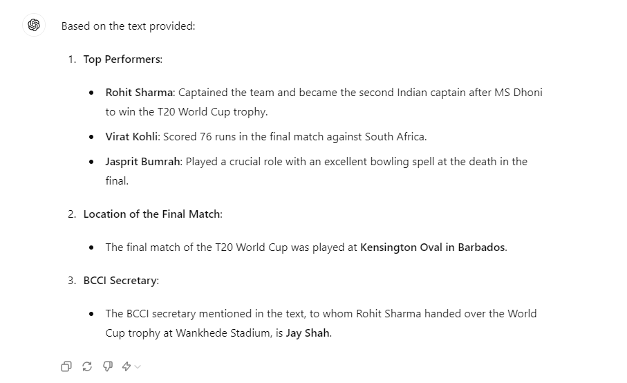
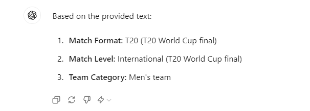
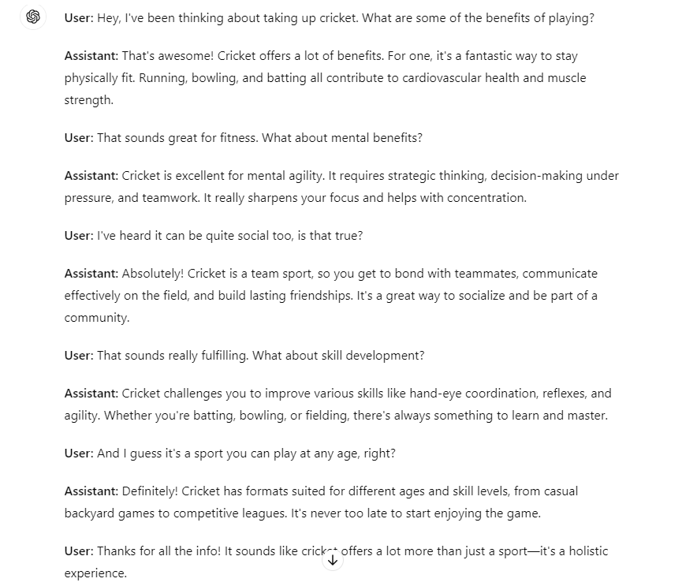
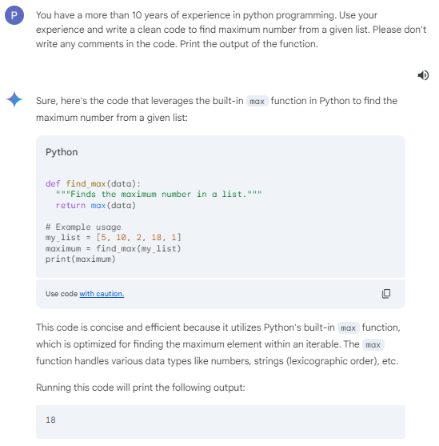
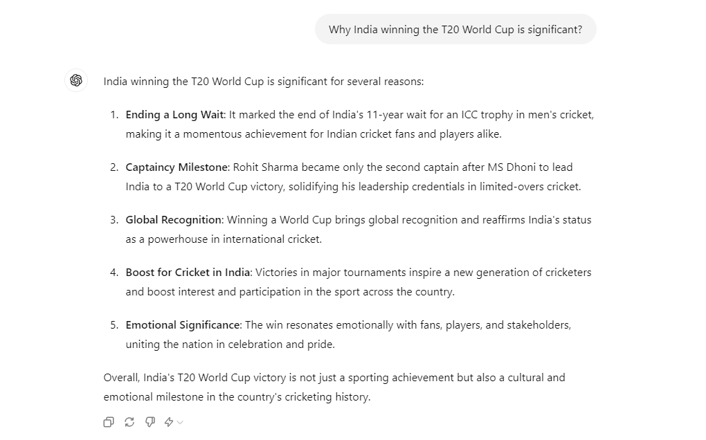

# Text:

The Indian cricket team landed in New Delhi on Thursday morning in a special Air India chartered plane from Barbados. After a 3-day wait on the Caribbean island after the T20 World Cup triumph, the cricket heroes returned home with the trophy. The BCCI shared a video of the players taking the trophy off of the chartered plane.
A big group of fans welcomed the team at the airport. Captain Rohit Sharma headed out of the airport with the trophy in his hand. Virat Kohli received a rousing reception and the star player waved to the fans, acknowledging their support.
Notably, the Men in Blue were left stranded in Barbados for four days after winning the coveted title with the airport shut down due to Hurricane Beryl. Once the weather improved, a special Air India chartered flight was sent to Barbados to bring the World Champions back home.
After a long journey of around 18 hours, the team has finally landed in India as fans have been waiting in long queues since late night to see their favorite stars. Special arrangements have been made for the team’s welcome both at the airport and the team hotel.
A special cake representing the World Cup Trophy has been also made for the team which will be cut at the team’s arrival in the hotel. Welcome drinks representing the national tricolor are also ready for the entire team. Following a special meet up with the PM, the team will fly to Mumbai for a special road show for the fans starting from Nariman point to the Wankhede Stadium where the entire team will be honored.
Team India defeated South Africa in the T20 World Cup final on Saturday. Rohit Sharma became only the second captain after MS Dhoni to win the T20 World Cup trophy for India. It was also the end of the 11-year-long wait for an ICC trophy in men's cricket.
India posted 176 in the big final at the Kensington Oval in Barbados. Virat Kohli top-scored with 76 after which the bowlers led the show. South Africa were cruising at one point, needing just 30 off 30. However, Jasprit Bumrah stepped up and delivered a miserly spell at the death to deliver the victory for India.
Following the victory, Rohit Sharma, Virat Kohli and Ravindra Jadeja retired from T20Is. It was also the end of coach Rahul Dravid's tenure.

#Text Summarization

Prompt: Summarize the following text about Indian Cricket Team:
[Text]

# Information Extraction

Prompt: Extract key information from the following text about India's cricket team in 5 points. 
[Text]

Prompt: Extract key information from the following text about cricketers:
[Text]

#Question Answering

Prompt: Answer the following questions based on the text about the indian cricket team:
[Text] 
1. Who are the top performers? 
2. Where was the final match played? 
3. Who is the BCCI secretary?

#Text Classification 

Prompt: Classify the following text about a cricket match into one of the categories:
1. Test, ODI, T20 
2. International, Domestic 
3. Men's team, Women's team, Under 19 team 
[Text]

#Conversation 

Prompt: Have a conversation about the benefits of playing cricket. Role: User & Assistant.

#Code Generation

Prompt: You have more than 10 years of experience in python programming. Use your experience and write a clean code to find the maximum number from a given list. Please don’t write any comments in the code. Print the output of the function.

#Reasoning

Prompt: Why is India winning the T-20 World Cup is significant?

#Chain-of-Thought :It improves reasoning capabilities.

Example with simple prompt:

Example with chain of thought prompting:

